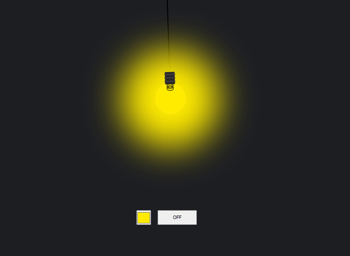

# 💡 Light Bulb Project

An interactive Light Bulb project built using **HTML, CSS, and JavaScript**.

This project allows users to:

* 💡 Turn the light ON/OFF
* 🎨 Change the bulb color dynamically
* ⚡ Experience a simple interactive UI

## 🚀 Features

* Responsive Design
* Light ON/OFF Toggle
* Dynamic Color Changing
* Simple JavaScript DOM Manipulation

## 🛠️ Technologies Used

* HTML5
* CSS3
* JavaScript

## 📸 Preview




## 🔗 Live Demo

```
https://iamdeveloperrayhan.github.io/light-bulb-project/
```

## 👨‍💻 Author

**Developer Rayhan**

GitHub:

```
https://github.com/iamdeveloperrayhan
```

---

⭐ If you like this project, feel free to give it a star!
